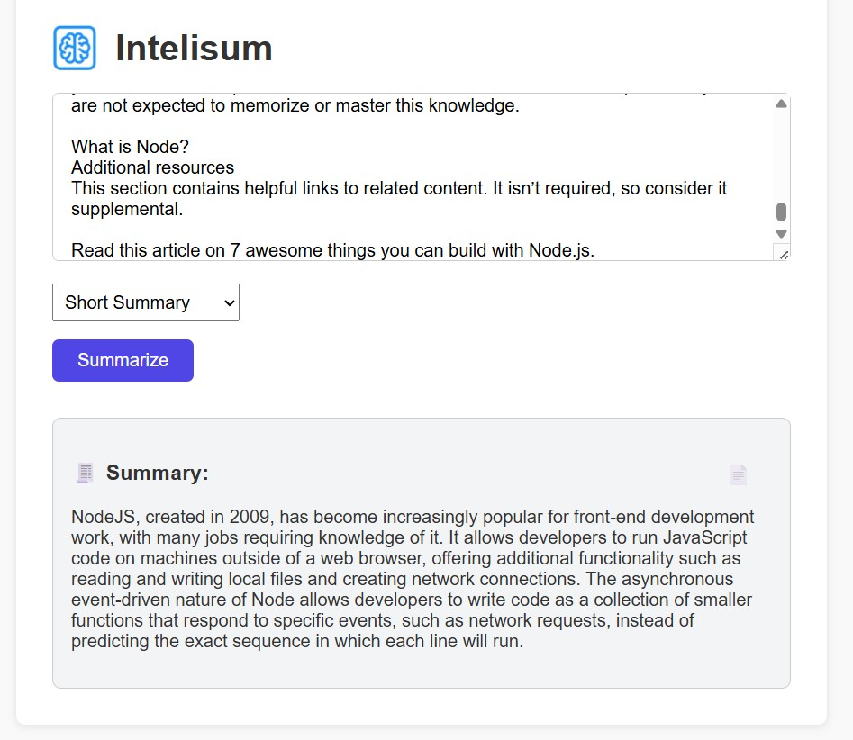

<div align="center">
 
  <h1>Intelisum</h1>
   <h3>Don’t read it all. Intelisum it</h3>

  <p>🧠 Smarter Summaries. Powered by AI. Intelisum is your intelligent, minimal text summarizer using OpenAI & React.</p>
  
</div>

---

## 🚀 Features

- 🧠 Summarize long texts into **short or detailed outputs**
- 🤖 Powered by **OpenAI GPT-3.5**
- 🎨 Clean, minimal UI using **TailwindCSS**
- 📋 One-click copy-to-clipboard
- ⚡ Built with **Vite + React** and deployed on **Vercel**

---

## 🧠 How It Works

1. Paste your text
2. Choose summary type (short / detailed)
3. Click **Summarize**
4. Instantly receive a smart, concise summary

---

## 📸 Screenshot

<table>
  <tr>
    <td></td> 
  </tr>
</table>

---

## 🛠️ Tech Stack

- **React** + **Vite**
- **OpenAI API**
- **TailwindCSS**
- **Vercel**

---

## 📦 Installation

```bash
git clone https://github.com/your-username/intelisum.git
cd intelisum
npm install
# Add your OpenAI key in .env
VITE_OPENAI_API_KEY=your_openai_key_here
npm run dev
```

````

---

## 🧾 Prompt Design

- **Short Summary**

  > Summarize the following text in 2–3 sentences: \[TEXT]

- **Detailed Summary**

  > Provide a detailed, bullet-point summary of this article: \[TEXT]

---

## ⚡ Example Output

> **Original Text:** Lorem ipsum dolor sit amet...
>
> **Short Summary:** This article explains...
>
> **Detailed Summary:**
>
> - Point A
> - Point B
> - Point C

---

## 💬 Feedback & Sharing

⭐ Star the repo if you like it
🧵 Share it with your dev friends
📬 Pull requests, issues, and suggestions are welcome

- [Twitter](https://x.com/LinSchmitz)

---

## 🧑‍💻 Author

Made with ☕&❤️ by [Lin Schmitz](https://github.com/LinSchmitz)

```
````

```
intelisum/
├── public/
│   └── index.html
├── src/
│   ├── App.jsx
│   ├── main.jsx
│   ├── style.css
│   └── components/
│       └── SummaryBox.jsx
├── .env
├── .gitignore
├── README.md
├── LICENSE
└── vite.config.js
```

https://openrouter.ai/settings/keys
